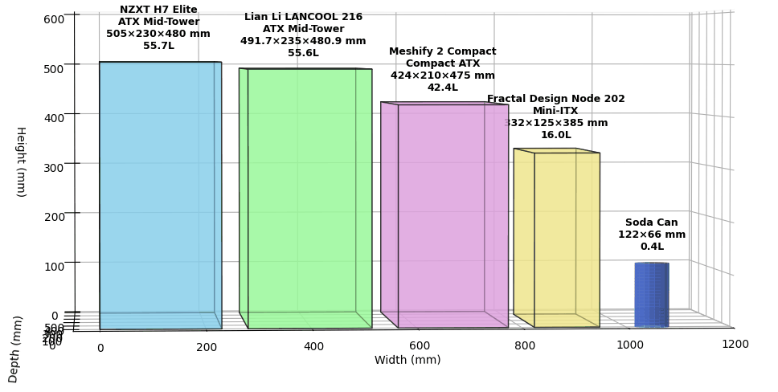

# pc-case-viz-compare

Simple Python script to visualize dimensions of a PC case.



## Setup

To set up the project, follow these steps:

### Prerequisites

- Python 3.x installed on your system.

### Create a Virtual Environment

1. Open a terminal and navigate to the project directory:

   ```bash
   cd path/to/pc-case-viz-compare
   ```

2. Create a virtual environment:

   ```bash
   python -m venv venv
   ```

3. Activate the virtual environment:

   - On Windows:

     ```bash
     .\venv\Scripts\activate
     ```

   - On macOS and Linux:

     ```bash
     source venv/bin/activate
     ```

### Install Dependencies

With the virtual environment activated, install the required dependencies:

```bash
pip install -r requirements.txt
```

### Running the Application

To run the application, execute the following command:

```bash
python app.py
```

## Customization

You can easily tweak the case names and dimensions in the `app.py` file to suit your needs. This allows you to visualize different PC cases by adjusting the parameters in the `cases` dictionary.

For accurate code tweaks and obtaining dimensions of desired cases, consider using AI tools like ChatGPT or Claude. These tools can provide guidance and suggestions for modifying the code effectively.

## License

This project is licensed under the terms of the LICENSE file.
